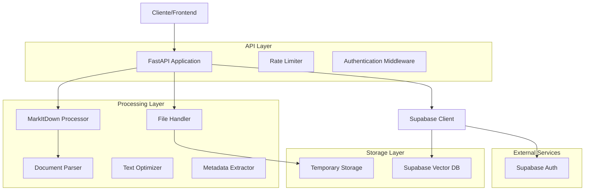
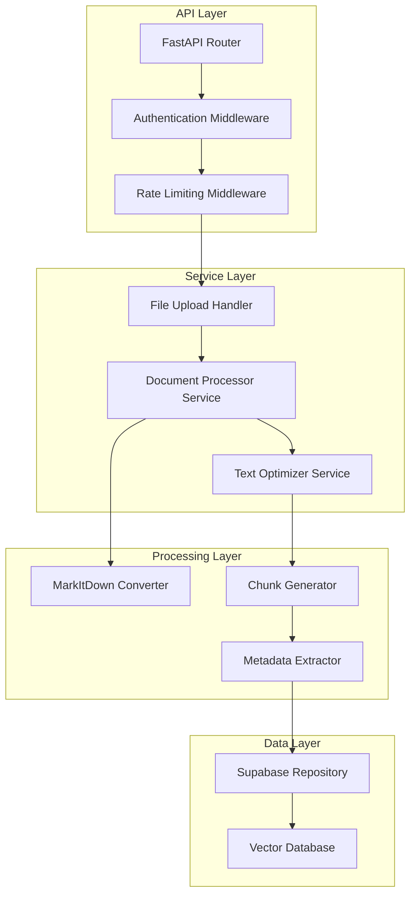
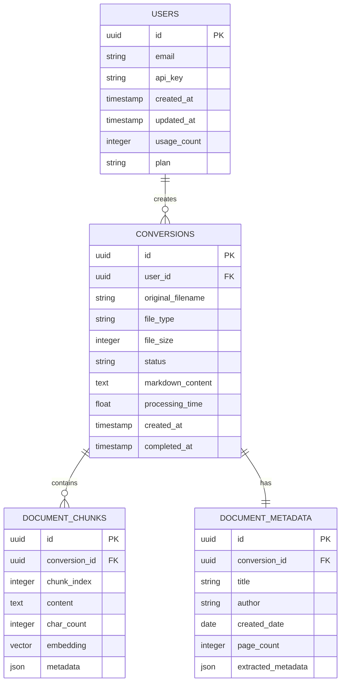

# Arquitectura Técnica - API de Conversión de Documentos

## 1. Diseño de Arquitectura



## 2. Descripción de Tecnologías

- **Backend**: FastAPI@0.104 + uvicorn@0.24 + python@3.11
- **Procesamiento**: markitdown[all]@0.1.0 + python-multipart@0.0.6
- **Base de datos**: Supabase (PostgreSQL con pgvector)
- **Autenticación**: Supabase Auth + python-jose[cryptography]@3.3.0
- **Utilidades**: pydantic@2.5 + python-dotenv@1.0.0

## 3. Definiciones de Rutas

| Ruta | Propósito |
|------|----------|
| POST /api/v1/convert | Endpoint principal para conversión de documentos DOCX/PDF a markdown |
| GET /api/v1/convert/{conversion_id} | Obtener estado y resultado de una conversión específica |
| GET /api/v1/conversions | Listar historial de conversiones del usuario |
| POST /api/v1/convert/batch | Conversión en lote de múltiples documentos |
| GET /api/v1/health | Endpoint de salud para monitoreo del servicio |
| GET /api/v1/formats | Listar formatos de archivo soportados y límites |
| DELETE /api/v1/conversions/{conversion_id} | Eliminar conversión y archivos asociados |

## 4. Definiciones de API

### 4.1 API Principal

**Conversión de documento**
```
POST /api/v1/convert
```

Request (multipart/form-data):
| Nombre del Parámetro | Tipo de Parámetro | Es Requerido | Descripción |
|---------------------|-------------------|--------------|-------------|
| file | UploadFile | true | Archivo DOCX o PDF a convertir |
| optimize_for_rag | boolean | false | Optimizar salida para RAG (default: true) |
| chunk_size | integer | false | Tamaño de chunks para vectorización (default: 1000) |
| include_metadata | boolean | false | Incluir metadatos extraídos (default: true) |
| insert_to_supabase | boolean | false | Insertar directamente en Supabase (default: false) |

Response:
| Nombre del Parámetro | Tipo de Parámetro | Descripción |
|---------------------|-------------------|-------------|
| conversion_id | string | ID único de la conversión |
| status | string | Estado: 'processing', 'completed', 'failed' |
| markdown_content | string | Contenido convertido a markdown |
| metadata | object | Metadatos extraídos del documento |
| chunks | array | Texto dividido en chunks para RAG |
| processing_time | float | Tiempo de procesamiento en segundos |

Ejemplo de Response:
```json
{
  "conversion_id": "conv_123456789",
  "status": "completed",
  "markdown_content": "# Título del Documento\n\nContenido...",
  "metadata": {
    "title": "Documento Ejemplo",
    "author": "Juan Pérez",
    "created_date": "2024-01-15",
    "file_size": 245760,
    "page_count": 5
  },
  "chunks": [
    {
      "id": 1,
      "content": "Primer chunk de texto...",
      "char_count": 987
    }
  ],
  "processing_time": 2.34
}
```

**Obtener estado de conversión**
```
GET /api/v1/convert/{conversion_id}
```

Response:
| Nombre del Parámetro | Tipo de Parámetro | Descripción |
|---------------------|-------------------|-------------|
| conversion_id | string | ID de la conversión |
| status | string | Estado actual de la conversión |
| result | object | Resultado de la conversión (si está completa) |
| error_message | string | Mensaje de error (si falló) |

## 5. Diagrama de Arquitectura del Servidor



## 6. Modelo de Datos

### 6.1 Definición del Modelo de Datos



### 6.2 Lenguaje de Definición de Datos

**Tabla de Usuarios (users)**
```sql
-- Crear tabla de usuarios
CREATE TABLE users (
    id UUID PRIMARY KEY DEFAULT gen_random_uuid(),
    email VARCHAR(255) UNIQUE NOT NULL,
    api_key VARCHAR(255) UNIQUE NOT NULL,
    created_at TIMESTAMP WITH TIME ZONE DEFAULT NOW(),
    updated_at TIMESTAMP WITH TIME ZONE DEFAULT NOW(),
    usage_count INTEGER DEFAULT 0,
    plan VARCHAR(20) DEFAULT 'free' CHECK (plan IN ('free', 'premium', 'enterprise'))
);

-- Crear índices
CREATE INDEX idx_users_api_key ON users(api_key);
CREATE INDEX idx_users_email ON users(email);

-- Permisos Supabase
GRANT SELECT ON users TO anon;
GRANT ALL PRIVILEGES ON users TO authenticated;
```

**Tabla de Conversiones (conversions)**
```sql
-- Crear tabla de conversiones
CREATE TABLE conversions (
    id UUID PRIMARY KEY DEFAULT gen_random_uuid(),
    user_id UUID REFERENCES users(id) ON DELETE CASCADE,
    original_filename VARCHAR(255) NOT NULL,
    file_type VARCHAR(10) NOT NULL CHECK (file_type IN ('pdf', 'docx')),
    file_size INTEGER NOT NULL,
    status VARCHAR(20) DEFAULT 'processing' CHECK (status IN ('processing', 'completed', 'failed')),
    markdown_content TEXT,
    processing_time FLOAT,
    error_message TEXT,
    created_at TIMESTAMP WITH TIME ZONE DEFAULT NOW(),
    completed_at TIMESTAMP WITH TIME ZONE
);

-- Crear índices
CREATE INDEX idx_conversions_user_id ON conversions(user_id);
CREATE INDEX idx_conversions_status ON conversions(status);
CREATE INDEX idx_conversions_created_at ON conversions(created_at DESC);

-- Permisos Supabase
GRANT SELECT ON conversions TO anon;
GRANT ALL PRIVILEGES ON conversions TO authenticated;
```

**Tabla de Metadatos de Documento (document_metadata)**
```sql
-- Crear tabla de metadatos
CREATE TABLE document_metadata (
    id UUID PRIMARY KEY DEFAULT gen_random_uuid(),
    conversion_id UUID REFERENCES conversions(id) ON DELETE CASCADE,
    title VARCHAR(500),
    author VARCHAR(255),
    created_date DATE,
    page_count INTEGER,
    extracted_metadata JSONB,
    created_at TIMESTAMP WITH TIME ZONE DEFAULT NOW()
);

-- Crear índices
CREATE INDEX idx_document_metadata_conversion_id ON document_metadata(conversion_id);
CREATE INDEX idx_document_metadata_title ON document_metadata USING gin(to_tsvector('spanish', title));

-- Permisos Supabase
GRANT SELECT ON document_metadata TO anon;
GRANT ALL PRIVILEGES ON document_metadata TO authenticated;
```

**Tabla de Chunks de Documento (document_chunks)**
```sql
-- Habilitar extensión de vectores
CREATE EXTENSION IF NOT EXISTS vector;

-- Crear tabla de chunks
CREATE TABLE document_chunks (
    id UUID PRIMARY KEY DEFAULT gen_random_uuid(),
    conversion_id UUID REFERENCES conversions(id) ON DELETE CASCADE,
    chunk_index INTEGER NOT NULL,
    content TEXT NOT NULL,
    char_count INTEGER NOT NULL,
    embedding vector(1536), -- Para OpenAI embeddings
    metadata JSONB,
    created_at TIMESTAMP WITH TIME ZONE DEFAULT NOW()
);

-- Crear índices
CREATE INDEX idx_document_chunks_conversion_id ON document_chunks(conversion_id);
CREATE INDEX idx_document_chunks_embedding ON document_chunks USING ivfflat (embedding vector_cosine_ops);
CREATE INDEX idx_document_chunks_content ON document_chunks USING gin(to_tsvector('spanish', content));

-- Permisos Supabase
GRANT SELECT ON document_chunks TO anon;
GRANT ALL PRIVILEGES ON document_chunks TO authenticated;
```

**Datos iniciales**
```sql
-- Insertar usuario de prueba
INSERT INTO users (email, api_key, plan) VALUES 
('admin@example.com', 'test_api_key_123456789', 'enterprise');

-- Función para generar API keys
CREATE OR REPLACE FUNCTION generate_api_key()
RETURNS TEXT AS $$
BEGIN
    RETURN 'mk_' || encode(gen_random_bytes(32), 'hex');
END;
$$ LANGUAGE plpgsql;
```