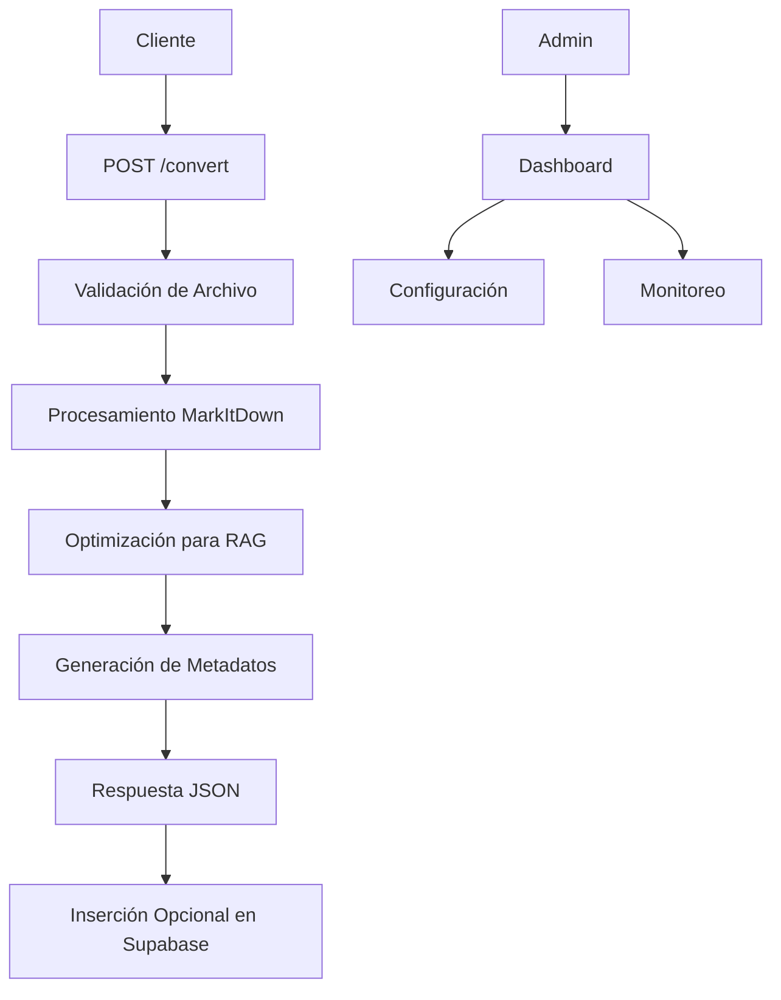

# API de Conversión de Documentos para RAG

## 1. Descripción General del Producto

API REST en Python que convierte documentos DOCX y PDF a formato markdown optimizado para sistemas RAG (Retrieval Augmented Generation) con Supabase Vector Database. La API utiliza la librería MarkItDown de Microsoft para preservar la estructura del documento mientras genera texto compatible con embeddings vectoriales.

El producto resuelve el problema de preparar documentos corporativos para búsqueda semántica, permitiendo a desarrolladores integrar fácilmente contenido documental en aplicaciones de IA conversacional.

## 2. Características Principales

### 2.1 Roles de Usuario

| Rol | Método de Registro | Permisos Principales |
|-----|-------------------|---------------------|
| Usuario API | Clave API | Puede subir y convertir documentos, acceder a historial de conversiones |
| Administrador | Configuración del sistema | Gestión de usuarios, monitoreo de uso, configuración de límites |

### 2.2 Módulo de Características

Nuestra API de conversión de documentos consta de las siguientes páginas principales:

1. **Endpoint de Conversión**: subida de archivos, procesamiento con MarkItDown, optimización para vectores.
2. **Dashboard de Monitoreo**: estadísticas de uso, historial de conversiones, métricas de rendimiento.
3. **Gestión de Archivos**: almacenamiento temporal, limpieza automática, gestión de metadatos.
4. **Configuración de API**: límites de tamaño, formatos soportados, configuración de Supabase.

### 2.3 Detalles de Páginas

| Nombre de Página | Nombre del Módulo | Descripción de Características |
|------------------|-------------------|-------------------------------|
| Endpoint de Conversión | Procesador de Archivos | Recibir archivos DOCX/PDF vía POST, validar formato y tamaño, convertir usando MarkItDown, optimizar texto para embeddings, retornar markdown estructurado |
| Endpoint de Conversión | Preparación para Vector DB | Dividir texto en chunks apropiados, limpiar formato para embeddings, generar metadatos de documento, preparar para inserción en Supabase |
| Dashboard de Monitoreo | Panel de Estadísticas | Mostrar número de conversiones, tipos de archivo procesados, tiempo promedio de procesamiento, errores recientes |
| Dashboard de Monitoreo | Historial de Conversiones | Listar conversiones recientes, mostrar estado de procesamiento, permitir descarga de resultados, filtrar por fecha/tipo |
| Gestión de Archivos | Almacenamiento Temporal | Guardar archivos subidos temporalmente, limpiar archivos antiguos automáticamente, gestionar límites de almacenamiento |
| Gestión de Archivos | Metadatos de Documento | Extraer información del archivo (título, autor, fecha), generar hash único, almacenar información de procesamiento |
| Configuración de API | Límites y Validación | Configurar tamaño máximo de archivo, tipos de archivo permitidos, límites de rate limiting, configuración de timeouts |
| Configuración de API | Integración Supabase | Configurar conexión a Supabase, definir esquema de tabla de vectores, configurar políticas de acceso |

## 3. Proceso Principal

**Flujo de Conversión de Documentos:**

1. El usuario envía un archivo DOCX o PDF al endpoint `/convert`
2. La API valida el formato, tamaño y autenticación
3. El archivo se procesa con MarkItDown para extraer contenido estructurado
4. El texto se optimiza para embeddings (limpieza, segmentación)
5. Se generan metadatos del documento y se prepara para Supabase
6. Se retorna el markdown procesado junto con metadatos
7. Opcionalmente, se puede insertar directamente en Supabase Vector DB

**Flujo de Administración:**

1. El administrador accede al dashboard de monitoreo
2. Revisa estadísticas de uso y rendimiento
3. Configura límites y parámetros de la API
4. Gestiona la limpieza de archivos temporales

## 4. Diseño de Interfaz de Usuario

### 4.1 Estilo de Diseño

- **Colores primarios**: Azul (#2563eb) y Verde (#16a34a) para estados exitosos
- **Colores secundarios**: Gris (#6b7280) para texto secundario, Rojo (#dc2626) para errores
- **Estilo de botones**: Redondeados con sombra sutil, estados hover definidos
- **Fuente**: Inter o system-ui, tamaños 14px (texto), 16px (botones), 24px (títulos)
- **Estilo de layout**: Diseño limpio tipo dashboard con tarjetas, navegación lateral
- **Iconos**: Lucide React o Heroicons para consistencia

### 4.2 Resumen de Diseño de Páginas

| Nombre de Página | Nombre del Módulo | Elementos de UI |
|------------------|-------------------|----------------|
| Endpoint de Conversión | Área de Subida | Zona de drag & drop, indicador de progreso, lista de archivos soportados, botón de conversión prominente |
| Dashboard de Monitoreo | Panel de Métricas | Tarjetas con estadísticas numéricas, gráficos de línea para tendencias, tabla de conversiones recientes |
| Gestión de Archivos | Lista de Archivos | Tabla con paginación, filtros por fecha/tipo, acciones de descarga/eliminación, indicadores de estado |
| Configuración de API | Formularios de Config | Campos de entrada con validación, toggles para características, botones de guardar/resetear |

### 4.3 Responsividad

La aplicación está diseñada mobile-first con adaptación para desktop. Incluye optimización táctil para dispositivos móviles y navegación simplificada en pantallas pequeñas.