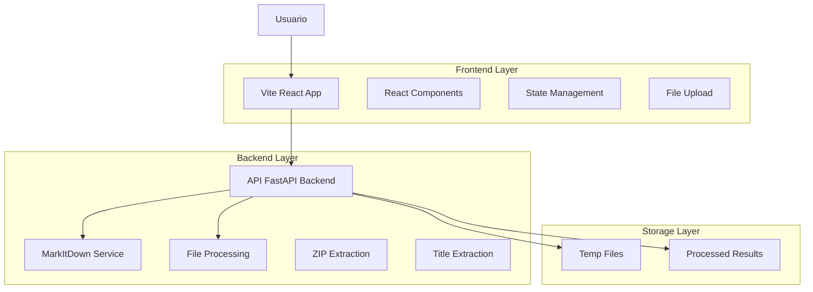
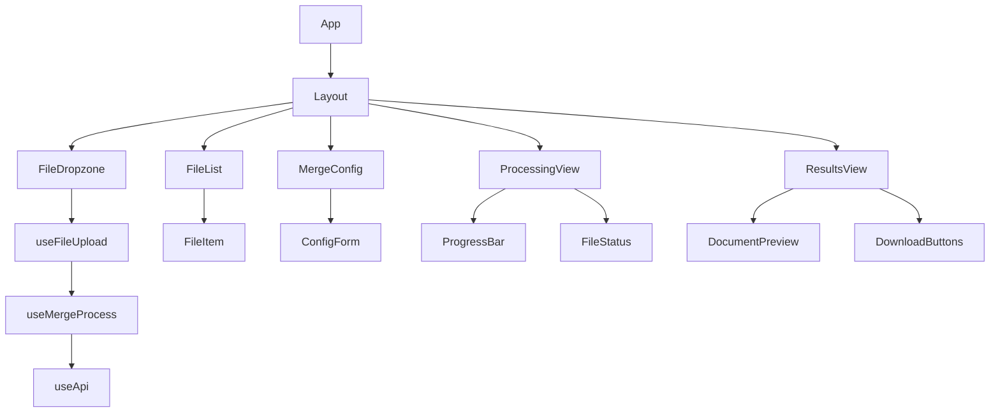
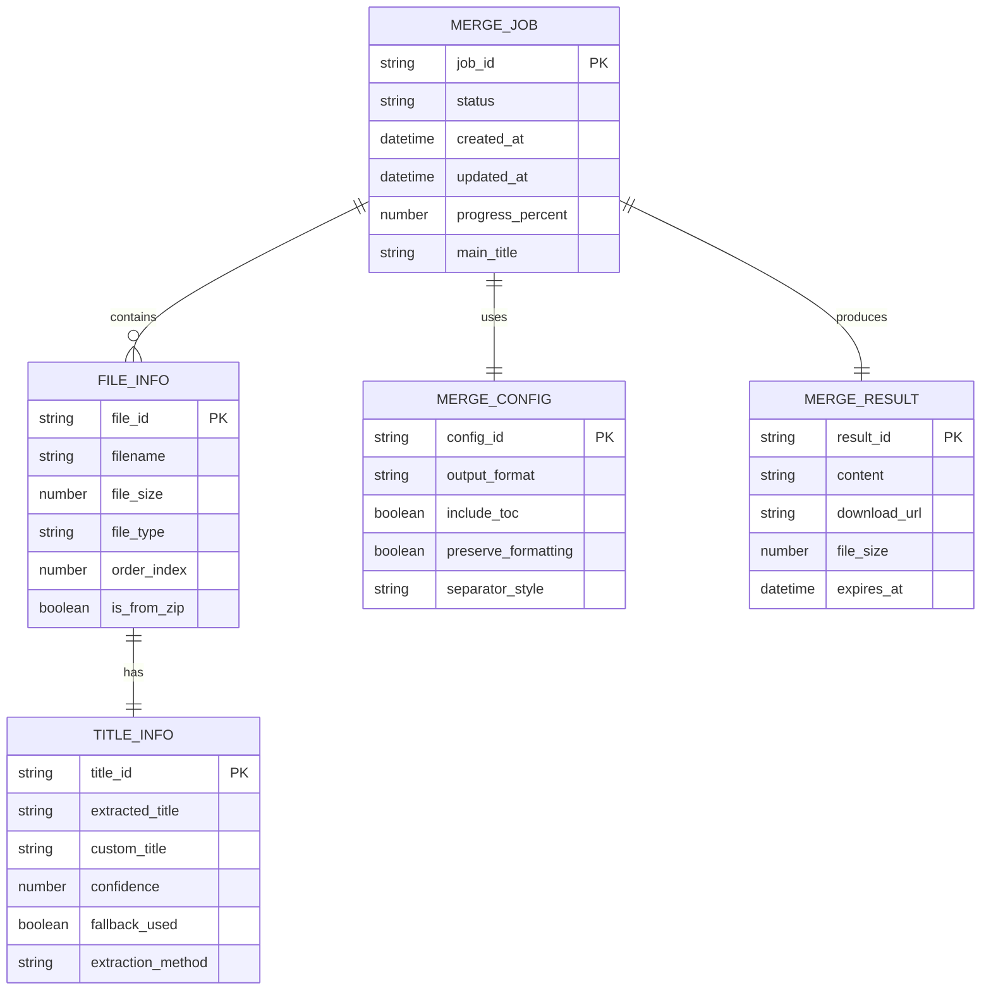

# Arquitectura Técnica - Mini WebApp de Fusión de Documentos

## 1. Arquitectura General



## 2. Stack Tecnológico

- **Frontend**: React@18 + TypeScript + Vite@5 + TailwindCSS@3
- **Backend**: FastAPI + MarkItDown + Python 3.11+
- **Librerías Adicionales**: 
  - Frontend: react-dropzone, lucide-react, framer-motion
  - Backend: python-zipfile, python-magic, pypdf

## 3. Estructura del Proyecto Frontend

```
frontend/
├── public/
│   └── favicon.ico
├── src/
│   ├── components/
│   │   ├── ui/
│   │   │   ├── Button.tsx
│   │   │   ├── Card.tsx
│   │   │   ├── Progress.tsx
│   │   │   └── Input.tsx
│   │   ├── FileDropzone.tsx
│   │   ├── FileList.tsx
│   │   ├── MergeConfig.tsx
│   │   ├── ProcessingView.tsx
│   │   ├── ResultsView.tsx
│   │   └── Layout.tsx
│   ├── hooks/
│   │   ├── useFileUpload.ts
│   │   ├── useMergeProcess.ts
│   │   └── useApi.ts
│   ├── services/
│   │   ├── api.ts
│   │   ├── fileUtils.ts
│   │   └── titleExtractor.ts
│   ├── types/
│   │   ├── file.ts
│   │   ├── api.ts
│   │   └── merge.ts
│   ├── utils/
│   │   ├── constants.ts
│   │   └── helpers.ts
│   ├── App.tsx
│   ├── main.tsx
│   └── index.css
├── package.json
├── vite.config.ts
├── tailwind.config.js
└── tsconfig.json
```

## 4. Definiciones de Rutas

| Ruta | Propósito |
|------|----------|
| / | Página principal con drag & drop y configuración |
| /processing/:jobId | Vista de procesamiento en tiempo real |
| /results/:jobId | Vista de resultados y descarga |

## 5. Definiciones de API

### 5.1 APIs Principales

**Extracción de títulos**
```
POST /api/extract-titles
```

Request:
| Parámetro | Tipo | Requerido | Descripción |
|-----------|------|-----------|-------------|
| files | File[] | true | Archivos para extraer títulos |

Response:
| Parámetro | Tipo | Descripción |
|-----------|------|-------------|
| titles | TitleInfo[] | Títulos extraídos con metadata |

Ejemplo:
```json
{
  "titles": [
    {
      "filename": "documento1.docx",
      "extracted_title": "Informe Anual 2024",
      "confidence": 0.95,
      "fallback_used": false
    }
  ]
}
```

**Procesamiento de ZIP**
```
POST /api/extract-zip
```

Request:
| Parámetro | Tipo | Requerido | Descripción |
|-----------|------|-----------|-------------|
| zip_file | File | true | Archivo ZIP a extraer |

Response:
| Parámetro | Tipo | Descripción |
|-----------|------|-------------|
| extracted_files | FileInfo[] | Archivos válidos extraídos |
| total_files | number | Total de archivos en ZIP |
| valid_files | number | Archivos DOCX/PDF válidos |

**Fusión mejorada con títulos**
```
POST /api/merge-documents
```

Request:
| Parámetro | Tipo | Requerido | Descripción |
|-----------|------|-----------|-------------|
| files | File[] | true | Archivos a fusionar |
| custom_titles | string[] | false | Títulos personalizados |
| main_title | string | false | Título principal del documento |
| output_format | string | false | Formato de salida |
| include_toc | boolean | false | Incluir tabla de contenidos |

Response:
| Parámetro | Tipo | Descripción |
|-----------|------|-------------|
| job_id | string | ID del trabajo de fusión |
| status | string | Estado del procesamiento |
| estimated_time | number | Tiempo estimado en segundos |

### 5.2 WebSocket para Actualizaciones en Tiempo Real

```
WS /ws/merge-progress/{job_id}
```

Mensajes:
```json
{
  "type": "progress",
  "job_id": "uuid",
  "current_file": 2,
  "total_files": 5,
  "current_step": "extracting_titles",
  "progress_percent": 40
}
```

## 6. Arquitectura de Componentes React



## 7. Modelo de Datos

### 7.1 Definición del Modelo de Datos



### 7.2 Definiciones TypeScript

```typescript
// Tipos principales
interface FileInfo {
  id: string;
  file: File;
  filename: string;
  size: number;
  type: 'docx' | 'pdf';
  orderIndex: number;
  isFromZip: boolean;
  titleInfo?: TitleInfo;
}

interface TitleInfo {
  extractedTitle: string;
  customTitle?: string;
  confidence: number;
  fallbackUsed: boolean;
  extractionMethod: 'header' | 'filename' | 'content';
}

interface MergeConfig {
  mainTitle: string;
  outputFormat: 'markdown' | 'pdf' | 'docx' | 'plain_text';
  includeToc: boolean;
  preserveFormatting: boolean;
  separatorStyle: 'h1' | 'h2' | 'custom';
}

interface MergeJob {
  jobId: string;
  status: 'pending' | 'processing' | 'completed' | 'failed';
  files: FileInfo[];
  config: MergeConfig;
  progress: {
    currentFile: number;
    totalFiles: number;
    currentStep: string;
    progressPercent: number;
  };
  result?: MergeResult;
  error?: string;
}

interface MergeResult {
  content: string;
  downloadUrl: string;
  fileSize: number;
  processingTime: number;
  statistics: {
    totalPages: number;
    totalWords: number;
    totalCharacters: number;
  };
}
```

## 8. Configuración de Vite

```typescript
// vite.config.ts
import { defineConfig } from 'vite'
import react from '@vitejs/plugin-react'
import path from 'path'

export default defineConfig({
  plugins: [react()],
  resolve: {
    alias: {
      '@': path.resolve(__dirname, './src'),
    },
  },
  server: {
    port: 3000,
    proxy: {
      '/api': {
        target: 'http://localhost:8002',
        changeOrigin: true,
      },
      '/ws': {
        target: 'ws://localhost:8002',
        ws: true,
      },
    },
  },
  build: {
    outDir: 'dist',
    sourcemap: true,
    rollupOptions: {
      output: {
        manualChunks: {
          vendor: ['react', 'react-dom'],
          ui: ['lucide-react', 'framer-motion'],
        },
      },
    },
  },
})
```

## 9. Mejoras del Backend

### 9.1 Nuevos Endpoints Requeridos

```python
# Nuevas funciones a agregar en main.py

@app.post("/extract-titles")
async def extract_titles_from_files(
    files: List[UploadFile] = File(...)
) -> Dict[str, Any]:
    """Extrae títulos de múltiples archivos"""
    pass

@app.post("/extract-zip")
async def extract_zip_contents(
    zip_file: UploadFile = File(...)
) -> Dict[str, Any]:
    """Extrae y valida contenidos de archivo ZIP"""
    pass

@app.websocket("/ws/merge-progress/{job_id}")
async def websocket_merge_progress(
    websocket: WebSocket, 
    job_id: str
):
    """WebSocket para actualizaciones de progreso"""
    pass
```

### 9.2 Dependencias Adicionales

```python
# Agregar a requirements.txt
websockets==12.0
python-magic==0.4.27
pypdf==3.0.1
zipfile36==0.1.3
```

## 10. Plan de Implementación

### Fase 1: Backend (Semana 1)
1. Implementar extracción de títulos
2. Agregar soporte para archivos ZIP
3. Crear endpoints de WebSocket
4. Extender soporte para PDF

### Fase 2: Frontend Base (Semana 2)
1. Configurar proyecto Vite + React + TypeScript
2. Implementar componentes UI básicos
3. Crear sistema de drag & drop
4. Integrar con API backend

### Fase 3: Funcionalidades Avanzadas (Semana 3)
1. Implementar extracción y edición de títulos
2. Agregar preview en tiempo real
3. Crear sistema de descarga múltiple
4. Optimizar para dispositivos móviles

### Fase 4: Pulimiento (Semana 4)
1. Pruebas exhaustivas
2. Optimización de rendimiento
3. Documentación de usuario
4. Deploy y configuración de producción