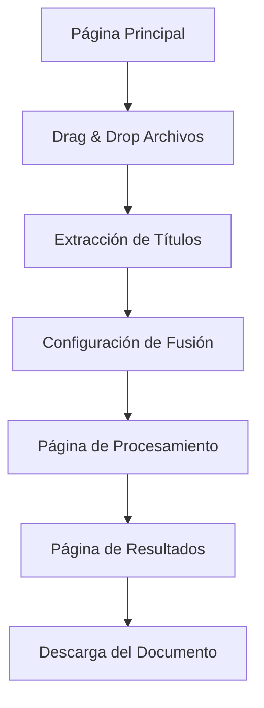

# Mini WebApp de Fusión de Documentos

## 1. Descripción General

Mini aplicación web desarrollada con Vite que permite fusionar múltiples documentos DOCX y PDF mediante una interfaz intuitiva de drag & drop. La aplicación extrae automáticamente los títulos de los documentos para usarlos como separadores principales en el documento fusionado final.

- **Objetivo**: Simplificar el proceso de fusión de documentos con una interfaz web moderna
- **Usuarios**: Profesionales que necesitan combinar múltiples documentos de forma rápida
- **Valor**: Automatización del proceso de fusión con extracción inteligente de títulos

## 2. Características Principales

### 2.1 Roles de Usuario

| Rol | Método de Acceso | Permisos Principales |
|-----|------------------|----------------------|
| Usuario General | Acceso directo a la webapp | Subir archivos, fusionar documentos, descargar resultados |

### 2.2 Módulos de Funcionalidad

La webapp consta de las siguientes páginas principales:

1. **Página Principal**: zona de drag & drop, lista de archivos, configuración de fusión
2. **Página de Procesamiento**: indicador de progreso, preview en tiempo real
3. **Página de Resultados**: preview del documento fusionado, opciones de descarga

### 2.3 Detalles de Páginas

| Página | Módulo | Descripción de Funcionalidad |
|--------|--------|------------------------------|
| Página Principal | Zona de Drag & Drop | Arrastrar y soltar archivos DOCX, PDF y ZIP. Validación automática de tipos de archivo |
| Página Principal | Lista de Archivos | Mostrar archivos seleccionados con preview de títulos extraídos. Reordenar archivos |
| Página Principal | Configuración | Seleccionar formato de salida, título del documento fusionado, opciones avanzadas |
| Página de Procesamiento | Indicador de Progreso | Barra de progreso en tiempo real, estado de cada archivo procesado |
| Página de Procesamiento | Preview Dinámico | Vista previa del contenido mientras se procesa la fusión |
| Página de Resultados | Preview del Resultado | Visualización completa del documento fusionado con títulos como separadores |
| Página de Resultados | Opciones de Descarga | Descargar en múltiples formatos (Markdown, PDF, DOCX, texto plano) |

## 3. Flujo Principal de Usuario

El usuario sigue este flujo para fusionar documentos:

1. **Subida de Archivos**: Arrastra archivos DOCX/PDF o ZIP a la zona de drop
2. **Extracción de Títulos**: La app extrae automáticamente títulos de cada documento
3. **Configuración**: Ajusta el orden, título general y formato de salida
4. **Procesamiento**: Inicia la fusión y monitorea el progreso
5. **Descarga**: Obtiene el documento fusionado en el formato deseado

## 4. Diseño de Interfaz

### 4.1 Estilo de Diseño

- **Colores Principales**: 
  - Primario: #3B82F6 (azul moderno)
  - Secundario: #10B981 (verde éxito)
  - Fondo: #F8FAFC (gris claro)
  - Texto: #1F2937 (gris oscuro)
- **Estilo de Botones**: Redondeados con sombras suaves, efectos hover
- **Tipografía**: Inter o system fonts, tamaños 14px-24px
- **Layout**: Diseño de tarjetas con espaciado generoso, navegación superior
- **Iconos**: Lucide React o Heroicons para consistencia moderna

### 4.2 Diseño de Páginas

| Página | Módulo | Elementos de UI |
|--------|--------|----------------|
| Página Principal | Zona de Drag & Drop | Área punteada grande con icono de upload, texto instructivo, animación al hover |
| Página Principal | Lista de Archivos | Tarjetas con nombre, tamaño, título extraído, botón eliminar, handles para reordenar |
| Página Principal | Configuración | Formulario con campos de título, selector de formato, toggle de opciones avanzadas |
| Página de Procesamiento | Progreso | Barra de progreso animada, lista de archivos con estados (pendiente/procesando/completado) |
| Página de Resultados | Preview | Panel dividido con navegación por secciones, scroll suave, resaltado de títulos |
| Página de Resultados | Descarga | Botones de descarga por formato, estadísticas del documento (páginas, palabras) |

### 4.3 Responsividad

- **Enfoque**: Mobile-first con adaptación a desktop
- **Breakpoints**: 640px (sm), 768px (md), 1024px (lg), 1280px (xl)
- **Interacciones táctiles**: Optimizado para touch en dispositivos móviles
- **Navegación**: Menú hamburguesa en móvil, navegación horizontal en desktop

## 5. Funcionalidades Técnicas Específicas

### 5.1 Extracción de Títulos

- **Método**: Análisis del primer párrafo o encabezado H1 de cada documento
- **Fallback**: Si no se encuentra título, usar nombre del archivo
- **Personalización**: Permitir edición manual de títulos extraídos
- **Validación**: Títulos únicos y no vacíos

### 5.2 Soporte de Archivos ZIP

- **Extracción**: Descomprimir automáticamente archivos ZIP
- **Filtrado**: Identificar solo archivos DOCX y PDF dentro del ZIP
- **Estructura**: Mantener orden alfabético de archivos extraídos
- **Límites**: Máximo 50 archivos por ZIP, 100MB total

### 5.3 Integración con API

- **Endpoint**: Utilizar `/merge-docx` existente con extensión para PDF
- **Comunicación**: WebSocket o polling para actualizaciones en tiempo real
- **Manejo de Errores**: Reintentos automáticos, mensajes de error claros
- **Caching**: Cache local de títulos extraídos para mejor UX

### 5.4 Formatos de Salida

- **Markdown**: Formato por defecto con títulos como separadores H1
- **PDF**: Conversión con tabla de contenidos automática
- **DOCX**: Documento Word con estilos consistentes
- **Texto Plano**: Versión simple sin formato

## 6. Mejoras de la API Backend

### 6.1 Extracción de Títulos

- Modificar función `convert_multiple_files_to_markdown()` para extraer títulos
- Agregar endpoint `/extract-titles` para preview de títulos
- Implementar lógica de detección de títulos en documentos PDF

### 6.2 Soporte para PDF

- Extender validación de archivos para incluir PDF
- Actualizar `ALLOWED_EXTENSIONS` para incluir `.pdf`
- Modificar función de conversión para manejar PDF con MarkItDown

### 6.3 Manejo de ZIP

- Agregar endpoint `/extract-zip` para procesar archivos ZIP
- Implementar extracción y validación de contenido ZIP
- Mantener orden y estructura de archivos extraídos